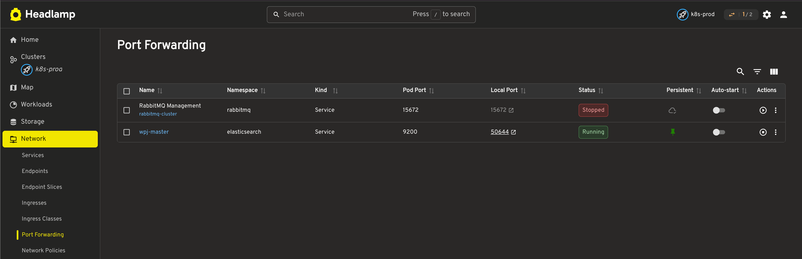
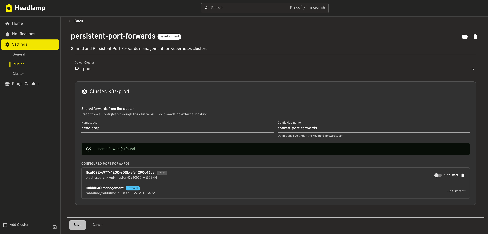

<p align="center">
  
</p>

<h1 align="center">Persistent Port Forwards</h1>

<p align="center">
  A <a href="https://headlamp.dev">Headlamp</a> plugin for port forwards that survive a restart,
  start themselves, and can be shared with your team through a ConfigMap.
</p>

<p align="center">
  <a href="https://github.com/ondrab1/headlamp-port-forwards/actions/workflows/ci.yml"></a>
  <a href="https://github.com/ondrab1/headlamp-port-forwards/releases/latest"></a>
  <a href="LICENSE"></a>
  
</p>

Headlamp can already start a port forward, but it forgets everything: after a restart you re-create
each one by hand, and there is no way to hand a colleague the set of forwards a project needs. This
plugin replaces the Port Forwarding page with one that remembers, auto-starts and shares.



## Features

- **One-click Resume** for a stopped forward, on its original port. When it targets a Service the
  pod is resolved again first, so it still works after the pod was replaced — which is exactly when
  the built-in Start fails.
- **Persistent forwards.** Pin a forward and the plugin re-creates it on the next start. Kept in the
  plugin settings, per cluster.
- **Shared forwards.** A ConfigMap in the cluster holds the forwards the whole team should have.
  Everyone pointing the plugin at it sees the same list.
- **Auto-start, opt-in per forward.** Anything without the flag is listed as stopped and waits for
  you.
- **Names that mean something.** `RabbitMQ Management` as the row title, with `rabbitmq-cluster`
  underneath.
- **Bulk Resume and Stop** for selected rows, and a **running count in the app bar** with progress
  while forwards are starting.
- **Clickable local ports** while a forward runs, greyed with the reason while it does not.

## Requirements

- Headlamp **0.30 or newer**, **desktop app**, on Linux, macOS or Windows. Port forwarding is not
  available in the browser build, so the page is disabled there — same as Headlamp's own.
- Nothing at all for persistent forwards and auto-start; they live in the local plugin settings.
- For shared forwards, access to one ConfigMap — see [Permissions](#permissions).

## Install

In Headlamp Desktop, open the Plugin Catalog, search for _Persistent Port Forwards_ and click
Install. Alternatively, download the tarball from the
[latest release](https://github.com/ondrab1/headlamp-port-forwards/releases) and install it through
the plugin manager.

Headlamp reads plugins at startup, so **restart the app** afterwards.

To build from source instead:

```bash
npm install
npm run build
```

## Sharing through a ConfigMap

The shared list lives in the cluster rather than behind a URL. It needs no hosting, is read through
the same authenticated path as everything else, and is not subject to CORS — a raw file URL from
GitLab or similar is blocked by the browser unless it sends `Access-Control-Allow-Origin`.

Point the plugin at a namespace and name in its settings. If the ConfigMap does not exist yet,
**Create** makes it (and its namespace, when that is missing too). Without permission to write, you
get the manifest to hand over.



The manifest looks like this:

```yaml
apiVersion: v1
kind: ConfigMap
metadata:
  name: shared-port-forwards
  namespace: headlamp
data:
  port-forwards.json: |
    [
      {
        "name": "RabbitMQ Management",
        "namespace": "rabbitmq",
        "service": "rabbitmq-cluster",
        "localPort": 15672,
        "targetPort": 15672,
        "autoStart": true
      }
    ]
```

| Field        | Required | Meaning                                                       |
| ------------ | -------- | ------------------------------------------------------------- |
| `name`       | yes      | Shown as the row title                                        |
| `namespace`  | yes      | Namespace of the service or pod                               |
| `service`    | one of   | Service to forward to; the pod is resolved from it            |
| `pod`        | one of   | Pod to forward to, when there is no service                   |
| `localPort`  | yes      | Port on your machine                                          |
| `targetPort` | yes      | Port on the pod                                               |
| `autoStart`  | no       | `true` starts it on entering the cluster. Absent means no.    |
| `id`         | no       | Stable identifier; derived from the fields above when omitted |

From the list, **Share with team** writes a forward into the ConfigMap and **Rename** changes its
name there. **Delete** asks for confirmation, and for a shared forward it offers to remove the entry
from the ConfigMap as well — unchecked by default, since that takes it away from everyone. Without
it, the forward is only stopped and the next refresh lists it again. All of these read the current
content before writing, so a colleague's change is not overwritten.

### Permissions

| Action                                             | Needs on the shared ConfigMap                                           |
| -------------------------------------------------- | ----------------------------------------------------------------------- |
| Reading the shared list                            | `get`                                                                   |
| Sharing, renaming, un-sharing, toggling auto-start | `update`                                                                |
| The **Create** button                              | `create` on configmaps, and on namespaces when the namespace is missing |

Everything degrades to a clear message plus a copyable manifest, so read-only users are not stuck.

## Contributing

Issues and pull requests are welcome. There is no CLA and no template to fill in — for a bug, what
broke and on which Headlamp version is enough.

```bash
npm start     # watch, build and install into the local Headlamp
npm test      # unit tests
npm run tsc   # type check (strict)
npm run lint  # eslint, no warnings allowed
npm run i18n  # extract translatable strings
```

CI runs `tsc`, `lint`, `test` and `build` on every pull request, so run them before pushing.

`npm start` copies the build into `~/Library/Application Support/Headlamp/plugins/<plugin-name>/` on
macOS and `~/.config/Headlamp/plugins/<plugin-name>/` elsewhere. Restart Headlamp to pick up a new
build; the plugin logs its build stamp to the console on load and shows it on its settings page, so
you can tell which build is running.

One design rule worth keeping: the logic that decides what a row is — configured, shared,
auto-starting, running — lives in `src/forwards.ts` with no React or Headlamp imports, and is covered
by `src/forwards.test.ts`. The awkward bugs in this plugin were all cases of two parts of the UI
reaching different conclusions about the same forward.

Useful references: the [Headlamp plugin docs](https://headlamp.dev/docs/latest/development/plugins/)
and the [plugin API reference](https://headlamp.dev/docs/latest/development/api/).

## Releasing

For maintainers. Releases are built and published by CI; for each one:

1. Update the `changes:` list in `artifacthub-pkg.template.yml` (`kind` of `added`, `changed`,
   `fixed` or `removed`). That list is the changelog — Headlamp's plugin catalog shows it and the
   GitHub release notes are rendered from it, so it is not written twice.
2. Bump `version` in `package.json`.
3. Commit, then push a tag:

```bash
git tag v0.1.5
git push origin main v0.1.5
```

That is the whole manual part. The workflow refuses to release if the tag and `package.json`
disagree, then runs the checks, builds the tarball, publishes the release with notes rendered from
the changelog, and only afterwards writes `releases/<version>/artifacthub-pkg.yml` on `main`.

### How the catalog entry gets there

ArtifactHub reads this repository from `main` and feeds Headlamp's in-app catalog. It indexes files:
**one `artifacthub-pkg.yml` is one version of the package**, which is why they live one per folder
under `releases/`. A single manifest that each release overwrote — what this repository did until
0.1.4 — leaves the catalog with exactly one version and erases the previous changelog along with it.

Two rules follow, and CI enforces both:

- `artifacthub-pkg.template.yml` is the copy a human edits, and its name keeps ArtifactHub from
  indexing it. The generated files under `releases/` are records of published releases; editing one
  rewrites what the catalog offers for a version that is already out.
- Nothing announces a version before its artifact exists. The workflow fills in `version`,
  `createdAt`, `archive-url` and `archive-checksum` after `gh release create` succeeds, so a failed
  build — or a trigger lost to an Actions outage — leaves the catalog one version behind instead of
  offering an install that 404s. Between the tag and the publish, `package.json` is therefore a
  version ahead of `releases/`, and that is the intended state.

CI downloads every artifact `releases/` points at and checks it against the recorded checksum, so a
catalog entry that has drifted out of step — including an old release whose asset was deleted years
later — shows up as a red `main` instead of as a failed install for a user.

If a tag ever ends up without a run, use the workflow's **Run workflow** button and give it the tag
name, rather than deleting and re-pushing the tag.

Building in CI is deliberate: `tar` records file timestamps, so a checksum from a local build would
not match the released file and Headlamp would refuse to install it. To build one locally anyway,
use `npm run package-release` — it stages the build under the package name first, whereas
`headlamp-plugin package` would name the folder inside the tarball after this repository, and
Headlamp would then load the release next to a development build instead of replacing it.

## License

[Apache-2.0](LICENSE)
